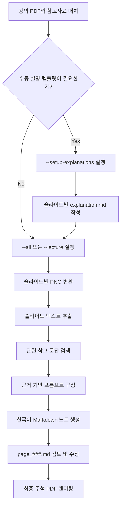
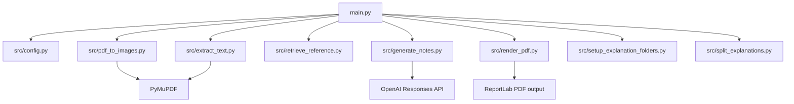

# Lecture Companion Agent

영어 강의 PDF를 페이지별로 분석해 한국어 학습용 Markdown 노트와 주석형 PDF를 만드는 강의 문서 설명 에이전트입니다.

이 프로젝트의 목표는 단순 번역이 아닙니다. 강의 슬라이드의 원문을 추출하고, 관련 교재/참고자료 내용을 함께 찾아, 학생이 이해하기 쉬운 한국어 설명으로 정리하는 것이 핵심입니다.

> 현재 상태: 로컬 CLI 프로토타입입니다. PDF 페이지 이미지 변환, 텍스트 추출, 간단한 키워드 기반 참고자료 검색, OpenAI 기반 Markdown 노트 생성, 수동 설명 Markdown 분리, 최종 주석 PDF 렌더링을 지원합니다. 벡터 검색 기반 RAG는 아직 구현되지 않았으며 **Planned** 항목입니다.

## Overview

Lecture Companion Agent는 영어 강의자료를 한국어로 복습하기 쉽게 바꾸는 도구입니다. 각 슬라이드마다 다음 정보를 조합합니다.

- 강의 PDF에서 추출한 페이지별 텍스트
- 선택적으로 추가한 교재/참고 PDF의 관련 문단
- 사용자가 직접 작성한 페이지별 설명 Markdown
- OpenAI API로 생성한 한국어 학습 노트

생성 결과는 먼저 Markdown으로 저장됩니다. 따라서 최종 PDF로 만들기 전에 사람이 내용을 검토하고 수정할 수 있습니다.

## Motivation

강의 슬라이드는 보통 핵심 키워드와 도식 중심으로 구성되어 있어, 문장 그대로 번역해도 맥락이 부족한 경우가 많습니다. 이 프로젝트는 슬라이드 내용을 한국어로 자연스럽게 풀어 설명하고, 필요한 경우 교재 내용을 근거로 보충 설명하는 학습 보조 에이전트를 목표로 합니다.

## Key Features

- `input/lectures/` 폴더의 PDF 일괄 처리
- PyMuPDF 기반 슬라이드별 PNG 이미지 변환
- 강의 PDF와 참고 PDF의 텍스트 추출
- 키워드 겹침 기반의 간단한 교재/참고자료 검색
- OpenAI API를 이용한 한국어 Markdown 노트 생성
- 사용자가 작성한 `explanation.md`를 슬라이드별 노트로 분리
- 원본 슬라이드 이미지를 왼쪽에, 한국어 설명 노트를 오른쪽에 배치한 최종 PDF 생성
- `--notes-only`, `--render-only`, `--overwrite-notes`, `--test-sample` 실행 모드
- 강의자료와 생성 결과를 Git에 올리지 않도록 설계된 로컬 데이터 구조

## Architecture

```mermaid
flowchart TD
    CLI[main.py CLI] --> Config[src/config.py]
    Config --> LecturePDF[input/lectures/*.pdf]
    Config --> ReferencePDF[input/references/*.pdf]
    Config --> ExplanationMD[input/explanations/*/explanation.md]
    LecturePDF --> Images[src/pdf_to_images.py]
    LecturePDF --> ExtractText[src/extract_text.py]
    ReferencePDF --> Retrieve[src/retrieve_reference.py]
    ExplanationMD --> Match[src/file_matching.py]
    Match --> Split[src/split_explanations.py]
    ExtractText --> Generate[src/generate_notes.py]
    Retrieve --> Generate
    Split --> Generate
    Generate --> Notes[output/{lecture}/notes/page_###.md]
    Images --> Render[src/render_pdf.py]
    Notes --> Render
    Render --> FinalPDF[output/{lecture}/final/annotated_explanation.pdf]
```

## Agent Workflow



## Data Structure

```mermaid
graph TD
    A[input/lectures] --> B[강의 PDF]
    C[input/references] --> D[교재/참고 PDF]
    E[input/explanations] --> F[강의별 explanation.md]
    B --> G[output/{lecture}/pages/page_###.png]
    B --> H[output/{lecture}/notes/page_###_source.txt]
    D --> I[메모리상의 참고 문단 chunk]
    F --> J[페이지별 수동 설명]
    H --> K[output/{lecture}/notes/page_###.md]
    I --> K
    J --> K
    G --> L[output/{lecture}/final/annotated_explanation.pdf]
    K --> L
```

현재 참고자료 검색은 추출된 텍스트의 키워드 겹침을 기준으로 동작합니다. 임베딩과 벡터 데이터베이스를 사용하는 RAG 구조는 **Planned**입니다.

## Directory Structure

```text
.
├── main.py                         # 배치 실행용 CLI 진입점
├── config.yaml                     # 로컬 파이프라인 설정
├── requirements.txt                # 실행 의존성
├── scripts/
│   └── create_sample_pdf.py         # 테스트용 샘플 PDF 생성
├── src/
│   ├── config.py                    # YAML 설정 로드와 경로 검증
│   ├── extract_text.py              # PDF 텍스트 추출
│   ├── file_matching.py             # 강의 PDF와 설명 파일 매칭
│   ├── generate_notes.py            # 한국어 Markdown 노트 생성
│   ├── pdf_to_images.py             # PDF 페이지 이미지 변환
│   ├── render_pdf.py                # 최종 주석 PDF 렌더링
│   ├── retrieve_reference.py        # 간단한 참고자료 검색
│   ├── setup_explanation_folders.py # 설명 템플릿 생성
│   └── split_explanations.py        # 슬라이드 heading 기준 노트 분리
├── input/
│   ├── lectures/                    # 로컬 강의 PDF, Git 제외
│   ├── references/                  # 로컬 참고 PDF, Git 제외
│   └── explanations/                # 로컬 설명 Markdown, Git 제외
└── output/                          # 생성 결과, Git 제외
```



## Tech Stack

- Python
- PyMuPDF: PDF 텍스트 추출 및 페이지 이미지 변환
- OpenAI Python SDK: 설명 노트 생성
- ReportLab: 최종 PDF 렌더링
- PyYAML: 설정 파일 관리
- Markdown: 검토 가능한 중간 산출물

## Usage

가상환경을 만들고 의존성을 설치합니다.

```powershell
py -m venv .venv
.\.venv\Scripts\Activate.ps1
pip install -r requirements.txt
```

API 키는 코드나 README에 저장하지 말고 로컬 셸 환경변수로만 설정합니다.

```powershell
$env:OPENAI_API_KEY="your_api_key_here"
```

샘플 PDF로 전체 흐름을 테스트합니다.

```powershell
python main.py --test-sample
```

`input/lectures/`의 모든 강의 PDF를 처리합니다.

```powershell
python main.py --all
```

특정 PDF 하나만 처리합니다.

```powershell
python main.py --lecture input/lectures/example.pdf
```

API 호출 없이 설명 템플릿만 생성합니다.

```powershell
python main.py --setup-explanations
```

이미 작성한 설명 Markdown을 페이지별 노트로 분리합니다.

```powershell
python main.py --split-explanations
```

노트만 생성하고 최종 PDF 렌더링은 건너뜁니다.

```powershell
python main.py --notes-only
```

기존 노트로 최종 PDF만 다시 렌더링합니다.

```powershell
python main.py --render-only
```

## Example Use Cases

- 영어 강의 슬라이드를 한국어 복습 노트로 변환
- 키워드만 있는 슬라이드에 교재 기반 맥락 추가
- 면접이나 발표 준비를 위해 강의 내용을 페이지별로 정리
- AI가 생성한 설명을 Markdown에서 먼저 검토한 뒤 PDF로 제작

## Security / Privacy Notes

- 실제 강의 PDF, 교재 PDF, 생성 결과, API 키, 개인 노트를 커밋하지 않습니다.
- `.gitignore`는 `input/` 내부 자료와 `output/` 결과물을 제외하도록 설정되어 있습니다.
- `OPENAI_API_KEY`는 로컬 환경변수나 비공개 환경 파일에만 보관합니다.
- 저작권이 있는 강의자료나 교재 내용을 공개 샘플로 올리지 않습니다.
- 로컬 절대경로, 비공개 URL, 계정명, 개인 환경값은 문서에 복사하지 않습니다.

이번 README 작성 과정에서는 API 키, 토큰, 개인 이메일, 전화번호, 비공개 URL, 내부 인증정보, 로컬 절대경로를 포함하지 않았습니다.

## Future Improvements

- **Planned:** 키워드 검색을 임베딩 기반 RAG로 교체
- **Planned:** 생성된 설명에 슬라이드/참고자료 출처를 더 명확히 연결하는 citation 형식 추가
- **Planned:** 스캔본이나 이미지 기반 PDF를 위한 OCR 지원
- **Planned:** CLI 실행 모드와 Markdown 분리 기능 테스트 추가
- **Planned:** 최종 PDF 생성 전 페이지별 노트를 검토하는 간단한 UI
- **Future Work:** 여러 LLM 제공자를 선택할 수 있는 provider 구조
