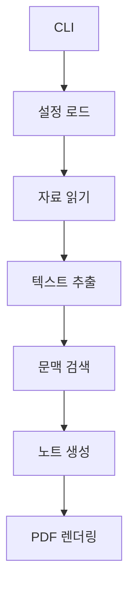
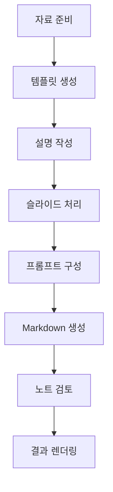
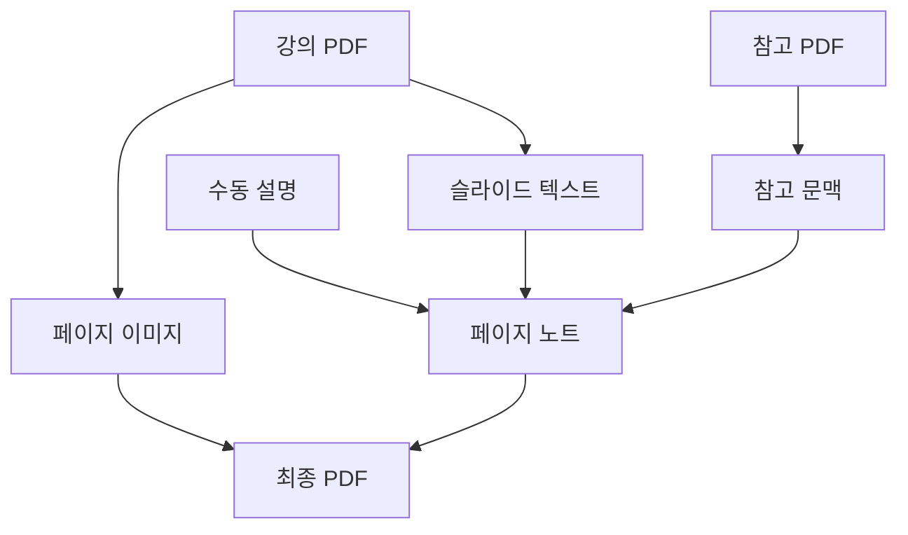
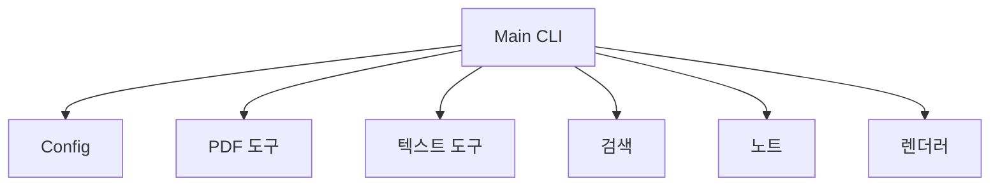

# Lecture Companion Agent

영어 강의 PDF를 한국어 학습용 Markdown 노트와 주석형 PDF로 변환하는 강의 문서 설명 에이전트입니다.

이 프로젝트의 목표는 단순 번역이 아닙니다. 슬라이드를 페이지별로 분석하고, 강의 텍스트와 교재/참고자료 맥락을 함께 사용해 공부하기 쉬운 한국어 설명을 만드는 것이 핵심입니다.

> 현재 상태: 로컬 CLI 프로토타입입니다. PDF 페이지 이미지 변환, 텍스트 추출, 키워드 기반 참고자료 검색, OpenAI 기반 Markdown 노트 생성, 수동 설명 분리, 주석형 PDF 렌더링을 지원합니다. 벡터 기반 RAG는 아직 구현되지 않았으며 **Planned**입니다.

## Overview

Lecture Companion Agent는 영어 강의자료를 한국어로 복습하기 쉽게 정리합니다. 각 슬라이드는 다음 자료를 바탕으로 설명될 수 있습니다.

- 강의 PDF에서 추출한 페이지별 텍스트
- 선택적으로 추가한 교재 또는 참고 PDF의 관련 문단
- 사용자가 직접 작성한 설명 Markdown
- OpenAI API로 생성한 한국어 학습 노트
- 원본 슬라이드와 설명을 함께 배치한 최종 PDF

생성 결과는 먼저 Markdown으로 저장됩니다. 따라서 최종 PDF를 만들기 전에 사람이 내용을 검토하고 수정할 수 있습니다.

## Motivation

강의 슬라이드는 보통 키워드, 도식, 짧은 영어 문장으로 압축되어 있습니다. 그대로 번역하면 맥락이 부족할 수 있습니다. 이 프로젝트는 슬라이드와 참고자료에 근거해 한국어로 자연스럽고 학습 친화적인 설명을 만드는 것을 목표로 합니다.

## Key Features

- 영어 강의자료의 한국어 설명
- 슬라이드별 Markdown 노트 생성
- PyMuPDF 기반 PDF 페이지 이미지 변환
- 강의 PDF와 참고 PDF의 텍스트 추출
- 키워드 겹침 기반 교재/참고자료 검색
- 참고자료 출처와 페이지 정보를 활용하는 citation-aware 문맥 구성
- 수동 `explanation.md` 입력 지원
- 원본 슬라이드와 한국어 설명을 함께 보여주는 주석형 PDF 렌더링
- 템플릿 생성, 노트 분리, 노트 생성, PDF 렌더링용 CLI 모드

## Architecture



자세한 경로는 Directory Structure 섹션에 정리되어 있습니다.

## Agent Workflow



수동으로 작성한 설명과 자동 생성 노트를 함께 사용할 수 있습니다. 수동 설명은 페이지별 Markdown 노트로 분리한 뒤 최종 PDF에 반영할 수 있습니다.

## Data Structure



생성된 이미지, 추출 텍스트, Markdown 노트, 최종 PDF는 설정된 output 폴더 아래에 저장됩니다. 현재 참고자료 검색은 키워드 기반이며, 임베딩 기반 RAG는 **Planned**입니다.

## Directory Structure

```text
.
|-- main.py
|-- config.yaml
|-- requirements.txt
|-- scripts/
|   `-- create_sample_pdf.py
|-- src/
|   |-- config.py
|   |-- extract_text.py
|   |-- file_matching.py
|   |-- generate_notes.py
|   |-- pdf_to_images.py
|   |-- render_pdf.py
|   |-- retrieve_reference.py
|   |-- setup_explanation_folders.py
|   `-- split_explanations.py
|-- input/
|   |-- lectures/
|   |-- references/
|   `-- explanations/
`-- output/
```

주요 폴더:

- `input/lectures/`: 로컬 강의 PDF를 넣는 위치입니다.
- `input/references/`: 교재 또는 참고 PDF를 넣는 위치입니다.
- `input/explanations/`: 사용자가 작성한 설명 Markdown을 넣는 위치입니다.
- `output/`: 생성된 이미지, 원문 텍스트, 노트, 최종 PDF가 저장됩니다.

## Module Relationships



자세한 경로는 Directory Structure 섹션에 정리되어 있습니다.

## Tech Stack

- Python
- PyMuPDF
- OpenAI Python SDK
- ReportLab
- PyYAML
- Markdown

## Usage

가상환경을 만들고 의존성을 설치합니다.

```powershell
py -m venv .venv
.\.venv\Scripts\Activate.ps1
pip install -r requirements.txt
```

API 키는 코드나 README에 저장하지 말고 로컬 셸 또는 비공개 환경 파일에만 설정합니다.

```powershell
$env:OPENAI_API_KEY="your_api_key_here"
```

샘플 PDF로 흐름을 테스트합니다.

```powershell
python main.py --test-sample
```

모든 강의 PDF를 처리합니다.

```powershell
python main.py --all
```

특정 강의 PDF 하나만 처리합니다.

```powershell
python main.py --lecture input/lectures/example.pdf
```

설명 템플릿을 생성합니다.

```powershell
python main.py --setup-explanations
```

기존 설명 Markdown을 페이지별 노트로 분리합니다.

```powershell
python main.py --split-explanations
```

노트만 생성하고 PDF 렌더링은 건너뜁니다.

```powershell
python main.py --notes-only
```

기존 노트로 최종 PDF만 다시 렌더링합니다.

```powershell
python main.py --render-only
```

## Example Use Cases

- 영어 강의 슬라이드를 한국어 복습 노트로 변환
- 키워드 중심 슬라이드에 교재 기반 맥락 추가
- 면접이나 발표 준비를 위한 페이지별 학습 자료 정리
- AI가 생성한 설명을 Markdown에서 먼저 검토한 뒤 PDF 제작

## Security / Privacy Notes

- 실제 강의 PDF, 교재 PDF, 생성 결과, API 키, 개인 노트를 커밋하지 않습니다.
- `OPENAI_API_KEY`는 소스 코드나 README에 저장하지 않습니다.
- 저작권이 있는 강의자료나 교재 내용을 공개 샘플로 올리지 않습니다.
- 비공개 URL, 개인 연락처, 로컬 절대경로, 환경값을 문서에 넣지 않습니다.

이 README에는 API 키, 토큰, 비공개 URL, 개인 이메일, 전화번호, 인증정보, 로컬 절대경로가 포함되어 있지 않습니다.

## Future Improvements

- **Planned:** 키워드 검색을 임베딩 기반 RAG로 교체
- **Planned:** 슬라이드와 참고자료 출처를 더 명확히 보여주는 citation 형식 추가
- **Planned:** 스캔본 PDF를 위한 OCR 지원
- **Planned:** CLI 모드와 Markdown 분리 기능 테스트 추가
- **Planned:** 생성 노트 검토용 간단한 UI 추가
- **Future Work:** 여러 LLM 제공자 지원
