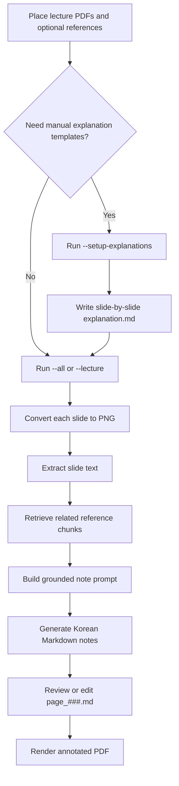
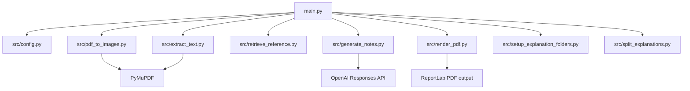

# Lecture Companion Agent

A command-line lecture document explanation agent that turns English lecture PDFs into Korean, study-friendly Markdown notes and annotated explanation PDFs.

The goal is not literal translation. The agent reads lecture slides page by page, extracts text, optionally retrieves related textbook/reference passages, generates Korean explanations with citation-aware context, and renders the original slide image beside editable Korean notes.

> Current status: local CLI prototype. It supports PDF-to-image conversion, text extraction, simple keyword-overlap reference retrieval, OpenAI-based Markdown note generation, manual explanation splitting, and annotated PDF rendering. Vector-search RAG is planned, not implemented.

## Overview

Lecture Companion Agent helps students review English lecture materials in Korean. For each slide, it combines:

- original lecture slide text
- optional reference/textbook PDF chunks
- optional manually prepared explanation Markdown
- generated Korean study notes

The output is kept as Markdown first so explanations can be reviewed, edited, and reused before generating the final PDF.

## Motivation

Lecture slides often contain compressed English terms, missing context, and textbook concepts that are hard to understand through direct translation alone. This project is designed to create a study companion that explains each page in Korean while grounding the explanation in the lecture and reference materials.

## Key Features

- Batch processing for PDFs in `input/lectures/`
- Slide-by-slide page rendering to PNG with PyMuPDF
- Text extraction from lecture and reference PDFs
- Simple textbook/reference retrieval using keyword overlap
- Korean Markdown note generation through the OpenAI API
- Optional manually prepared `explanation.md` files split into page notes
- Final annotated PDF rendering with the original slide on the left and Korean notes on the right
- `--notes-only`, `--render-only`, `--overwrite-notes`, and `--test-sample` CLI modes
- Local-data-first folder layout with generated outputs ignored by Git

## Architecture

```mermaid
flowchart TD
    CLI[main.py CLI] --> Config[src/config.py]
    Config --> LecturePDF[input/lectures/*.pdf]
    Config --> ReferencePDF[input/references/*.pdf]
    Config --> ExplanationMD[input/explanations/*/explanation.md]
    LecturePDF --> Images[src/pdf_to_images.py]
    LecturePDF --> ExtractText[src/extract_text.py]
    ReferencePDF --> Retrieve[src/retrieve_reference.py]
    ExplanationMD --> Match[src/file_matching.py]
    Match --> Split[src/split_explanations.py]
    ExtractText --> Generate[src/generate_notes.py]
    Retrieve --> Generate
    Split --> Generate
    Generate --> Notes[output/{lecture}/notes/page_###.md]
    Images --> Render[src/render_pdf.py]
    Notes --> Render
    Render --> FinalPDF[output/{lecture}/final/annotated_explanation.pdf]
```

## Agent Workflow



## Data Structure

```mermaid
graph TD
    A[input/lectures] --> B[Lecture PDF]
    C[input/references] --> D[Reference or textbook PDFs]
    E[input/explanations] --> F[Optional explanation.md by lecture]
    B --> G[output/{lecture}/pages/page_###.png]
    B --> H[output/{lecture}/notes/page_###_source.txt]
    D --> I[Reference chunks in memory]
    F --> J[Matched page explanations]
    H --> K[output/{lecture}/notes/page_###.md]
    I --> K
    J --> K
    G --> L[output/{lecture}/final/annotated_explanation.pdf]
    K --> L
```

Reference retrieval is currently implemented as keyword overlap over extracted text chunks. A semantic embedding/vector database pipeline is **Planned**.

## Directory Structure

```text
.
├── main.py                         # Batch CLI entry point
├── config.yaml                     # Local pipeline configuration
├── requirements.txt                # Runtime dependencies
├── scripts/
│   └── create_sample_pdf.py         # Smoke-test sample PDF generator
├── src/
│   ├── config.py                    # YAML loading and path validation
│   ├── extract_text.py              # PDF text extraction
│   ├── file_matching.py             # Lecture-to-explanation matching
│   ├── generate_notes.py            # Korean Markdown generation
│   ├── pdf_to_images.py             # PDF page rendering
│   ├── render_pdf.py                # Annotated PDF renderer
│   ├── retrieve_reference.py        # Simple reference retrieval
│   ├── setup_explanation_folders.py # Template creation
│   └── split_explanations.py        # Slide heading to page note splitter
├── input/
│   ├── lectures/                    # Local lecture PDFs, ignored by Git
│   ├── references/                  # Local reference PDFs, ignored by Git
│   └── explanations/                # Local explanation Markdown, ignored by Git
└── output/                          # Generated pages, notes, and PDFs, ignored by Git
```



## Tech Stack

- Python
- PyMuPDF for PDF text extraction and page rendering
- OpenAI Python SDK for note generation
- ReportLab for final PDF rendering
- PyYAML for configuration
- Markdown files as reviewable intermediate output

## Usage

Install dependencies in your own virtual environment:

```powershell
py -m venv .venv
.\.venv\Scripts\Activate.ps1
pip install -r requirements.txt
```

Set your API key only in the local shell or a private ignored environment file:

```powershell
$env:OPENAI_API_KEY="your_api_key_here"
```

Run a smoke test with a generated sample PDF:

```powershell
python main.py --test-sample
```

Process every lecture PDF in `input/lectures/`:

```powershell
python main.py --all
```

Process one PDF:

```powershell
python main.py --lecture input/lectures/example.pdf
```

Create explanation templates without calling the API:

```powershell
python main.py --setup-explanations
```

Split existing explanation Markdown into page notes:

```powershell
python main.py --split-explanations
```

Generate notes without rendering the final PDF:

```powershell
python main.py --notes-only
```

Render an annotated PDF from existing notes:

```powershell
python main.py --render-only
```

## Example Use Cases

- Convert an English slide deck into Korean study notes for weekly review
- Add textbook-grounded context to slides that only contain keywords or diagrams
- Prepare interview or presentation study material from lecture PDFs
- Review and improve AI-generated notes in Markdown before producing a final PDF

## Security / Privacy Notes

- Do not commit real lecture PDFs, textbooks, generated outputs, API keys, or private notes.
- `input/` contents and `output/` are ignored by `.gitignore`; only `.gitkeep` placeholders should be committed.
- Keep `OPENAI_API_KEY` in the local environment, not in source files or README examples.
- Avoid publishing copyrighted lecture or textbook content in generated samples.
- Local absolute paths, private URLs, account names, and environment values should not be copied into documentation.

During this README update, no API keys, tokens, personal emails, phone numbers, private URLs, credentials, or local absolute paths were included.

## Future Improvements

- **Planned:** Replace keyword-overlap retrieval with embedding-based RAG.
- **Planned:** Add citation formatting that links each generated explanation to specific slide and reference chunks.
- **Planned:** Add OCR support for scanned or image-only PDFs.
- **Planned:** Add tests for CLI modes and Markdown splitting.
- **Planned:** Add a small UI for reviewing page notes before rendering.
- **Future Work:** Support multiple LLM providers through a provider interface.
