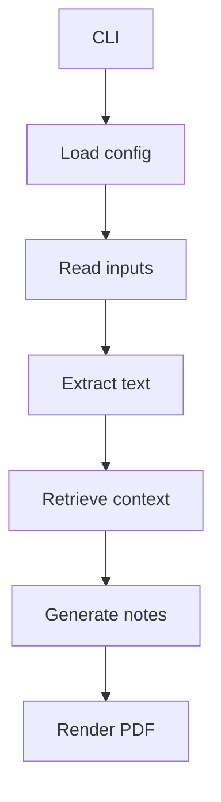
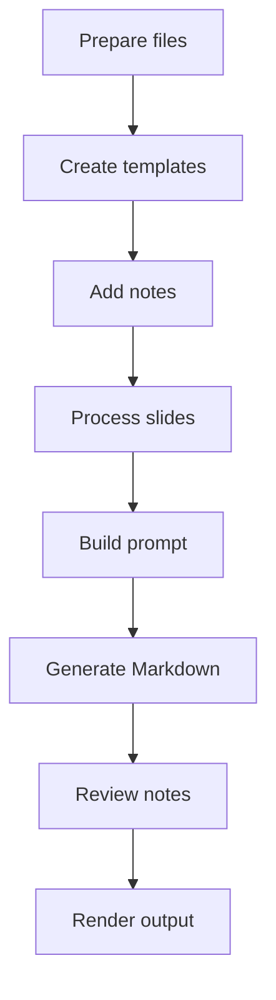
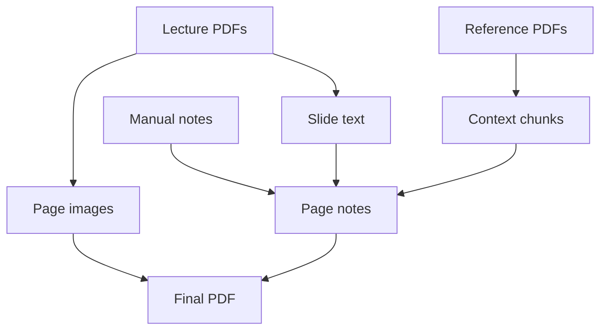
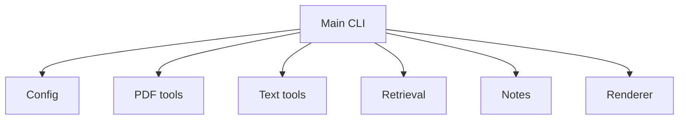

# Lecture Companion Agent

A lecture document explanation agent that turns English lecture PDFs into Korean, study-friendly Markdown notes and annotated explanation PDFs.

This project is designed for explanation, not simple translation. It processes slides page by page, extracts lecture text, retrieves related textbook or reference context, generates Korean notes, and renders the original slide beside the explanation.

> Current status: local CLI prototype. PDF rendering, text extraction, keyword-overlap reference retrieval, OpenAI-based Markdown note generation, manual explanation splitting, and annotated PDF rendering are implemented. Vector RAG is **Planned**, not implemented.

## Overview

Lecture Companion Agent helps students review English lecture materials in Korean. Each slide can be explained with:

- extracted lecture text
- optional textbook or reference PDF context
- optional manually written explanation Markdown
- generated Korean study notes
- a final annotated PDF layout

Markdown is used as the main intermediate format so the generated notes can be reviewed and edited before final rendering.

## Motivation

Lecture slides are often compressed into keywords, diagrams, and short English phrases. Direct translation can miss the teaching context. This project aims to produce Korean explanations that are easier to study while staying grounded in lecture slides and reference materials.

## Key Features

- English-to-Korean lecture explanation
- Slide-by-slide Markdown notes
- Lecture PDF page rendering with PyMuPDF
- PDF text extraction for lectures and references
- Textbook/reference grounding through keyword-overlap retrieval
- Citation-aware context in prompts through reference source and page metadata
- Optional manual `explanation.md` support
- Annotated PDF output with slide image and Korean notes
- CLI modes for setup, splitting, note generation, and rendering

## Architecture



Detailed paths are described in the Directory Structure section.

## Agent Workflow



The workflow supports both fully generated notes and manually prepared slide explanations. Manual explanations can be split into page-level Markdown notes before rendering.

## Data Structure



Generated page images, extracted text, Markdown notes, and final PDFs are written under the configured output directory. Reference retrieval is currently keyword based. Embedding search and vector storage are **Planned**.

## Directory Structure

```text
.
|-- main.py
|-- config.yaml
|-- requirements.txt
|-- scripts/
|   `-- create_sample_pdf.py
|-- src/
|   |-- config.py
|   |-- extract_text.py
|   |-- file_matching.py
|   |-- generate_notes.py
|   |-- pdf_to_images.py
|   |-- render_pdf.py
|   |-- retrieve_reference.py
|   |-- setup_explanation_folders.py
|   `-- split_explanations.py
|-- input/
|   |-- lectures/
|   |-- references/
|   `-- explanations/
`-- output/
```

Important folders:

- `input/lectures/`: local lecture PDFs.
- `input/references/`: local textbook or reference PDFs.
- `input/explanations/`: optional manually written Markdown explanations.
- `output/`: generated images, source text, notes, and final PDFs.

## Module Relationships



Detailed paths are described in the Directory Structure section.

## Tech Stack

- Python
- PyMuPDF
- OpenAI Python SDK
- ReportLab
- PyYAML
- Markdown

## Usage

Install dependencies in a local virtual environment:

```powershell
py -m venv .venv
.\.venv\Scripts\Activate.ps1
pip install -r requirements.txt
```

Set the API key only in your local shell or a private ignored environment file:

```powershell
$env:OPENAI_API_KEY="your_api_key_here"
```

Run a smoke test:

```powershell
python main.py --test-sample
```

Process all lecture PDFs:

```powershell
python main.py --all
```

Process one lecture PDF:

```powershell
python main.py --lecture input/lectures/example.pdf
```

Create explanation templates:

```powershell
python main.py --setup-explanations
```

Split existing explanation Markdown into page notes:

```powershell
python main.py --split-explanations
```

Generate notes without rendering:

```powershell
python main.py --notes-only
```

Render from existing notes:

```powershell
python main.py --render-only
```

## Example Use Cases

- Convert English lecture slides into Korean review notes.
- Explain slide keywords with textbook-grounded context.
- Prepare study material for interviews or presentations.
- Review AI-generated notes in Markdown before creating a final PDF.

## Security / Privacy Notes

- Do not commit real lecture PDFs, textbooks, generated outputs, API keys, or private notes.
- Keep `OPENAI_API_KEY` outside source code and README files.
- Do not publish copyrighted lecture or textbook content as examples.
- Do not include private URLs, personal contact data, local absolute paths, or environment values.

No API keys, tokens, private URLs, personal emails, phone numbers, credentials, or local absolute paths are included in this README.

## Future Improvements

- **Planned:** Replace keyword-overlap retrieval with embedding-based RAG.
- **Planned:** Add clearer citation formatting for slide and reference sources.
- **Planned:** Add OCR support for scanned PDFs.
- **Planned:** Add tests for CLI modes and Markdown splitting.
- **Planned:** Add a small review UI for generated page notes.
- **Future Work:** Support multiple LLM providers.
